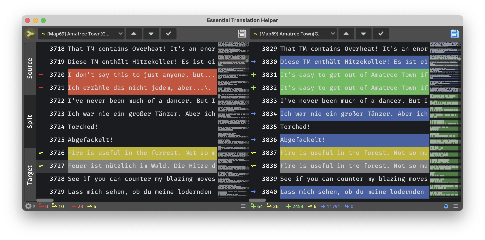
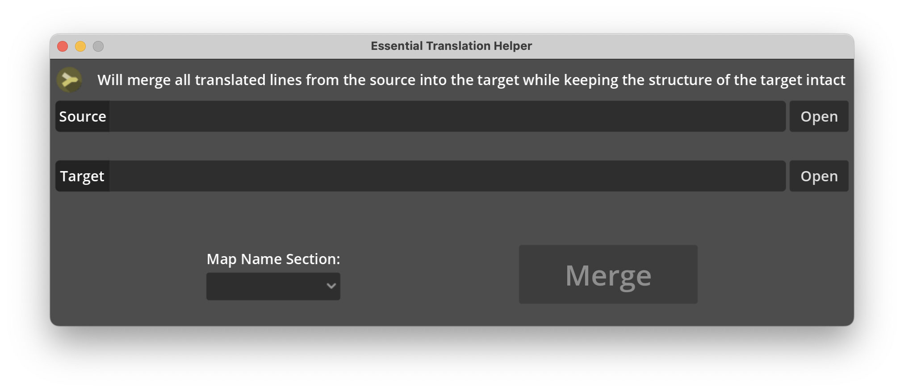

# Essential Translation Helper

Can merge and edit translation files (intl.txt).  
A program specially designed to ease the process of updating the translation after a patch.

Uses the translation format of Pokémon Essentials. One file per language.  
But might work for other engines too which use this format:
```
[Section]
Original line 1 or KEY
Translated line 1
Original line 2 or KEY
Translated line 2
...
```


# HowTo

## Update translation after a patch



**Prerequisites:**
- You need your most current translated intl_<language>.txt file and the new intl.txt file from the patch
- [Download](https://github.com/KoB-Kirito/Essential-Translation-Helper/releases) the newest Essential Translation Helper from [releases](https://github.com/KoB-Kirito/Essential-Translation-Helper/releases) or [build from source](#Build-from-source)



1. Open Essential Translation Helper.
   You are greeted with the file selection window.
   
2. Select your translated intl_<language>.txt file as source and the new intl.txt file as target.
   > [!IMPORTANT]
   > Check the line count. Newer files after a patch have more lines than before in most cases.
   > [!NOTE]
   > The source file will be merged into the target file. The merger expects the target to have the desired layout and will not it's structure. It will compare each section and parse all translations it finds into the new layout.
3. Select the section that contains the map names. This is 21 in current versions and 20 in older versions, but can also be something else if the game is modded. The selector gets filled after the target file got parsed. If it remains empty, the target file does not contain any suitable sections.
4. Click `Merge`
   > [!NOTE]
   > Depending on the size of the files the process can take several minutes.
5. I recommend to check the source file (left editor) for removed and edited lines first. Removed lines are marked with `-`, edited lines with `~`.
   > [!IMPORTANT]
   > You can navigate trough the entries with the last and next button above the editor.
   > The other editor will try to find a matching entry and also center on that.
   > [!NOTE]
   > Those are lines that were not found in the new file. They either got edited, replaced or removed altogether.
   > The merger will try to find similar lines and mark them as edited (`~`) if it's confident. Sometimes only a typo was corrected, then you can usually take over the translation.
6. Use the checkmark button to mark entries as done. They get marked as comment, so they don't get parsed if you load the file again.
   > [!IMPORTANT]
   > Save your progress often. (**Ctrl + S**)
   > The save icon will light up when there are unsaved changes.
7. After you checked everything in the source file you can concentrate on the target file. You can close the source editor with the buttons on the left side.
   > [!NOTE]
   > The merger still needs the source file later to parse which lines and sections are new.
8. Use the buttons above the editor to navigate through the new entries and mark them as translated when you're done.
   > [!NOTE]
   > If you jump to an entry in the target editor the original line is copied to clipboard.

## Build from source

The program is created with Godot.  
This repository contains the whole project.

1. Download and install Godot (https://godotengine.org)
   > [!NOTE]
   > The latest build was created with `Godot 4.2`
2. Download the project from this repo and open it with Godot
3. You can now just run it from the editor (F5)

_Optional_: Build your own executable
This process is well described here:
https://docs.godotengine.org/en/stable/tutorials/export/exporting_projects.html


# Known issues

- The scaling of pop-up menus is wrong on high dpi displays. This will be fixed in the next Godot version.
- Some actions can not be undone. Undo is complicated. Just don't make mistakes until I figure it out. (You can reset to last saved version with the bottom right button)


# Tipps

- Double click a line number in split view and the other editor will try to jump to the matching line
- Jumping in the target editor will copy the original line to your clipboard and select the translated line
- There is a shortcut to copy the translation of the currently selected entries from source to target: **Ctrl + ->**
- Click the split view button again to change the orientation
